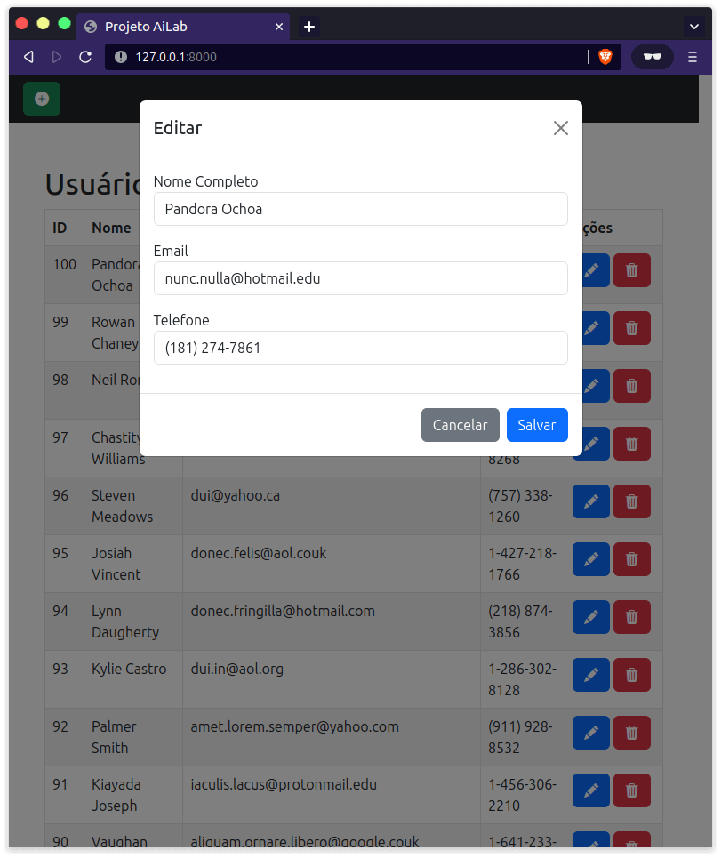

# Projeto AiLab

<p align="center">
  
</p>

## 🚀 Tecnologias

Esse projeto foi desenvolvido com as seguintes tecnologias:

- FastAPI
- SqlAlchemy
- Uvicorn
- Postgresql
- Docker

## 💻 Projeto

Projeto desenvolvido para o processo seletivo do Laboratório de Inteligência Artificial da Universidade de Brasília, trata-se um sistema de cadastro de usuários, no qual é possível criar, ler, editar e deletar usuários.

## 📌 Instalação

Clone o repositório:
```bash
  git clone https://github.com/brunobd/projeto-ailab.git 
```
Crie e ative o ambiente virtual python:
```bash
  python3 -m venv .venv
  source .venv/bin/activate
```
Instale os requimentos com
```bash
  pip install -r requirements.txt
```
Após isso é preciso preencher o arquivo database.ini com os dados do sistema de banco de dados
```ini
[database]
host: servidor
user: usuário
password: senha
port: porta
db: nome do banco de dados
```


Por fim, rodamos o servidor com
```bash
  uvicorn main:app --reload
```
